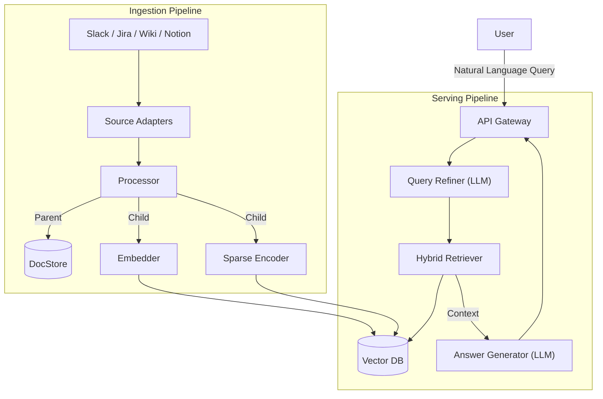

# Integrated RAG Search Service

## 📖 Overview
본 프로젝트는 Slack, Wiki, Jira, Notion 등 파편화된 데이터 소스를 통합하여 자연어 질문에 답변을 제공하는 **RAG(Retrieval-Augmented Generation) 기반 검색 서비스**입니다. LLM(OpenAI)을 활용하여 사용자의 질문 의도를 파악하고, 연결된 지식 베이스를 바탕으로 최적화된 답변을 생성합니다.

## ✨ Key Features
- **Natural Language Query**: 사용자의 자연어 질문을 이해하고 답변합니다.
- **Advanced Retrieval**: **Parent-Child Indexing** 전략을 통해 정밀한 검색과 풍부한 문맥을 동시에 제공합니다.
- **Query Refinement**: LLM을 이용해 모호한 질문을 구체화하거나 검색에 최적화된 형태로 변환합니다.
- **Multi-Source Integration**: Slack, Confluence, Jira, Notion 등 다양한 데이터 소스를 통합 검색합니다.
- **Extensible Architecture**: 새로운 데이터 소스를 쉽게 추가할 수 있는 플러그인(Adapter) 구조를 지향합니다.
- **Source Attribution**: 답변 생성 시 참고한 문서의 출처를 명시합니다.

## 📚 Documentation
프로젝트의 상세 문서와 설계 내역은 아래에서 확인할 수 있습니다.
- [**Requirements**](docs/requirements.md): 요구사항 정의서
- [**Architecture**](docs/architecture.md): 아키텍처 개요
- [**System Design**](docs/design.md): 상세 설계 및 모듈 명세

## 🛠 Tech Stack
- **LLM**: OpenAI API (GPT-4o, text-embedding-3-small)
- **Framework**: LlamaIndex (Orchestration)
- **Vector DB**: Qdrant (Self-hosted / Hybrid Search)
- **Backend**: Python (FastAPI)

## 🏗 High-Level Architecture



## 📂 Directory Structure
```
src/
├── ingestion/                  # [Ingestion Pipeline]
│   ├── adapters/               # Source Connectors (Strategy Pattern)
│   ├── processor.py            # Cleaning & Chunking Logic
│   ├── embedder.py             # Embedding Model Wrapper
│   └── vector_store.py         # Vector DB Connector
│
├── serving/                    # [Serving Pipeline]
│   ├── query_engine/
│   ├── retrieval/
│   └── generation/
│
├── common/                     # Shared Utilities
└── main.py                     # FastAPI Entrypoint
```
