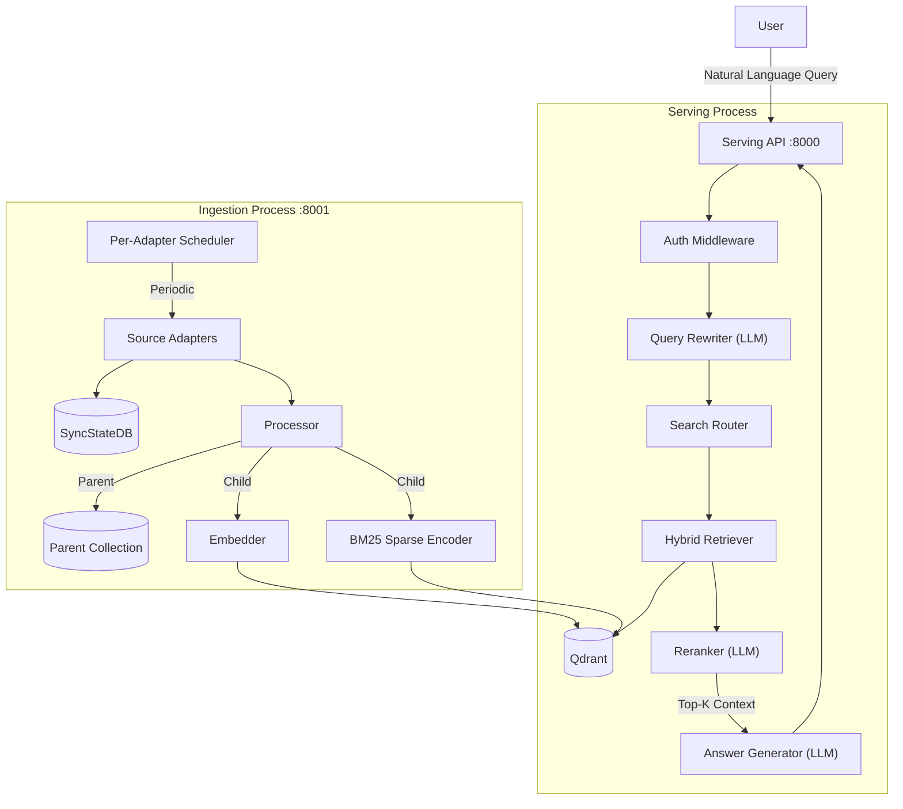

# Integrated RAG Search Service

## Overview
본 프로젝트는 Slack, Wiki, Jira, Notion 등 파편화된 데이터 소스를 통합하여 자연어 질문에 답변을 제공하는 **RAG(Retrieval-Augmented Generation) 기반 검색 서비스**입니다. LLM(OpenAI)을 활용하여 사용자의 질문 의도를 파악하고, 연결된 지식 베이스를 바탕으로 최적화된 답변을 생성합니다.

## Key Features
- **Natural Language Query**: 사용자의 자연어 질문을 이해하고 답변합니다.
- **Advanced Retrieval**: **Parent-Child Indexing** 전략을 통해 정밀한 검색과 풍부한 문맥을 동시에 제공합니다.
- **Query Refinement**: LLM을 이용해 모호한 질문을 구체화하거나 검색에 최적화된 형태로 변환합니다.
- **Multi-Source Integration**: Slack, Jira 등 다양한 데이터 소스를 통합 검색합니다.
- **Process Separation**: Serving API와 Ingestion Worker가 독립적인 프로세스로 분리되어 있습니다.
- **Per-Adapter Configuration**: 각 어댑터별로 활성화 여부, 수집 주기, 세부 옵션을 개별 설정할 수 있습니다.
- **Scheduled Ingestion**: 백그라운드 스케줄러가 주기적으로 데이터를 수집하며, SyncStateDB를 통해 증분 수집을 지원합니다.
- **Extensible Architecture**: 새로운 데이터 소스를 쉽게 추가할 수 있는 Adapter 구조입니다.
- **Source Attribution**: 답변 생성 시 참고한 문서의 출처를 명시합니다.
- **ACL Security**: 데이터 수집 시점부터 권한 정보를 저장하고, 검색 시 사용자 권한 내 문서만 반환합니다.
- **Observability**: Prometheus 메트릭 노출 및 Grafana 대시보드를 통한 실시간 모니터링을 지원합니다.

## Documentation
프로젝트의 상세 문서와 설계 내역은 아래에서 확인할 수 있습니다.
- [**Requirements**](docs/requirements.md): 요구사항 정의서
- [**Architecture**](docs/architecture.md): 아키텍처 개요
- [**System Design**](docs/design.md): 상세 설계 및 모듈 명세

## Tech Stack
- **LLM**: OpenAI API (GPT-4o, text-embedding-3-small)
- **Vector DB**: Qdrant (Self-hosted, Dense + Sparse Named Vectors)
- **Sparse Encoding**: BM25 기반 Sparse Vector 생성
- **Backend**: Python (FastAPI)
- **Sync DB**: MySQL 8.0 (SyncStateDB)
- **Monitoring**: Prometheus + Grafana
- **Infra**: Docker Compose (Serving + Ingestion + Qdrant + MySQL + Prometheus + Grafana)

## High-Level Architecture



## API Endpoints

### Serving API (Port 8000)
| Method | Path | Description |
|--------|------|-------------|
| `GET` | `/health` | 서비스 헬스체크 |
| `GET` | `/metrics` | Prometheus 메트릭 |
| `POST` | `/v1/chat/completions` | OpenAI Chat Completions API 호환 RAG 엔드포인트 |
| `POST` | `/v1/search` | RAG 검색 (답변 + 출처 반환) |

### Ingestion API (Port 8001)
| Method | Path | Description |
|--------|------|-------------|
| `GET` | `/health` | 워커 헬스체크 |
| `GET` | `/metrics` | Prometheus 메트릭 |
| `GET` | `/v1/scheduler/status` | 스케줄러 상태 조회 |
| `POST` | `/v1/ingest` | 단일 소스 수동 수집 |
| `POST` | `/v1/ingest/all` | 모든 활성 소스 수동 수집 |

### Monitoring
| Service | Port | Description |
|---------|------|-------------|
| Prometheus | `9090` | 메트릭 수집 및 저장 |
| Grafana | `3000` | 대시보드 및 시각화 (admin/admin) |

## Quick Start

```bash
# 1. 환경 변수 설정
cp .env.example .env
# .env 파일에서 OPENAI_API_KEY 등 필수 값 설정

# 2. Docker Compose로 실행
docker compose up --build

# 3. 헬스체크
curl http://localhost:8000/health  # Serving API
curl http://localhost:8001/health  # Ingestion Worker

# 4. 스케줄러 상태 확인
curl http://localhost:8001/v1/scheduler/status

# 5. 수동 데이터 수집
curl -X POST http://localhost:8001/v1/ingest \
  -H "Content-Type: application/json" \
  -d '{"source": "slack"}'

# 6. 검색
curl -X POST http://localhost:8000/v1/search \
  -H "Content-Type: application/json" \
  -H "X-User-Id: alice" \
  -H "X-User-Groups: engineering" \
  -d '{"query": "지난주 배포 에러 내역 알려줘"}'
```

## Directory Structure
```
src/
├── ingestion/                  # [Ingestion Worker Process]
│   ├── main.py                 # Ingestion Worker Entrypoint (Port 8001)
│   ├── adapters/               # Source Connectors (Strategy Pattern)
│   │   ├── base.py             # DataSourceAdapter ABC + RawDocument, DocumentACL
│   │   ├── slack.py            # Slack API Adapter
│   │   └── jira.py             # Jira REST API Adapter
│   ├── processor.py            # TextCleaner + Parent-Child Chunker
│   ├── embedder.py             # Dense Embedder + BM25 SparseEncoder
│   ├── vector_store.py         # Qdrant Connector (Parent/Child Collections)
│   ├── scheduler.py            # Per-Adapter Background Scheduler
│   └── sync_state.py           # MySQL SyncStateDB (Incremental Sync)
│
├── serving/                    # [Serving API Process]
│   ├── main.py                 # Serving API Entrypoint (Port 8000)
│   ├── core/
│   │   └── security.py         # UserContext Extraction (Header-based Auth)
│   ├── query_engine/
│   │   ├── rewriter.py         # LLM Query Refinement & Decomposition
│   │   └── router.py           # Search Strategy Routing
│   ├── retrieval/
│   │   ├── hybrid.py           # Secure Hybrid Retriever (ACL + Small-to-Big)
│   │   └── reranker.py         # LLM-based Reranker
│   └── generation/
│       ├── prompt.py           # System Prompt Templates
│       └── llm_client.py       # Answer Generator (GPT-4o)
│
└── common/                     # Shared Utilities
    ├── openai_utils.py         # OpenAI Client Singleton
    ├── config.py               # pydantic-settings Configuration (Per-Adapter)
    └── metrics.py              # Prometheus Metrics Definitions

scripts/
└── init.sql                    # MySQL 초기화 스크립트

monitoring/
├── prometheus/
│   └── prometheus.yml          # Prometheus 설정
└── grafana/
    ├── provisioning/           # Grafana 자동 설정
    └── dashboards/             # RAG Service 대시보드
```

## Configuration
모든 설정은 환경 변수 또는 `.env` 파일로 관리됩니다. 상세 항목은 [.env.example](.env.example)을 참고하세요.

### 주요 설정
| 환경 변수 | 기본값 | 설명 |
|-----------|--------|------|
| `OPENAI_API_KEY` | - | OpenAI API 키 (필수) |
| `QDRANT_HOST` | `localhost` | Qdrant 호스트 (Docker에서는 `qdrant`) |
| `MYSQL_HOST` | `localhost` | MySQL 호스트 (Docker에서는 `mysql`) |
| `INGESTION_INTERVAL_MINUTES` | `60` | 글로벌 자동 수집 주기 (분) |
| `INGESTION_ENABLED` | `true` | 백그라운드 수집 활성화 여부 |

### Per-Adapter 설정
| 환경 변수 | 기본값 | 설명 |
|-----------|--------|------|
| `SLACK_ENABLED` | `true` | Slack 어댑터 활성화 |
| `SLACK_SYNC_INTERVAL_MINUTES` | `0` | Slack 수집 주기 (0=글로벌 설정 사용) |
| `SLACK_CHANNEL_TYPES` | `public_channel,private_channel` | 수집할 채널 타입 |
| `SLACK_MESSAGE_LIMIT` | `200` | 채널당 최대 메시지 수 |
| `JIRA_ENABLED` | `true` | Jira 어댑터 활성화 |
| `JIRA_SYNC_INTERVAL_MINUTES` | `0` | Jira 수집 주기 (0=글로벌 설정 사용) |
| `JIRA_PROJECTS` | (empty) | 수집할 프로젝트 키 (쉼표 구분, 비어있으면 전체) |
| `JIRA_JQL_FILTER` | (empty) | 커스텀 JQL 필터 |
| `JIRA_MAX_RESULTS` | `100` | 최대 이슈 수 |
