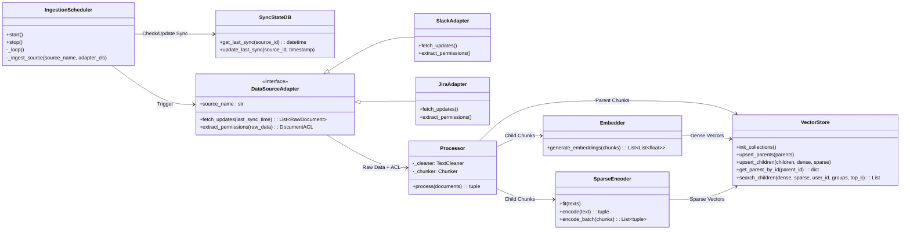
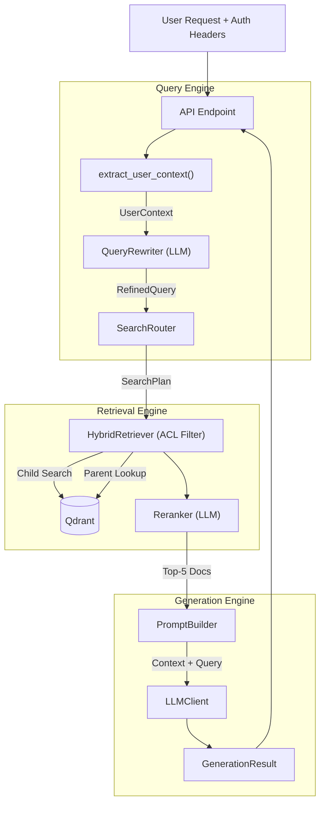

# System Design & Architecture

본 문서는 **Integrated RAG Search Service**의 상세 기술 설계를 다룹니다. 시스템은 **독립적인 두 개의 프로세스**로 구성됩니다:
- **Serving Process** (Port 8000): 사용자 요청을 실시간으로 처리하는 검색 API
- **Ingestion Process** (Port 8001): 백그라운드에서 데이터를 수집하는 워커

각 프로세스는 별도의 컨테이너로 배포되며, 공통 Vector DB(Qdrant)를 통해 데이터를 공유합니다. 보안 요구사항(ACL)을 준수하기 위해 권한 관리 모듈이 각 파이프라인에 통합되어 있습니다.

---

## 1. Ingestion Pipeline (Data ETL)

Ingestion Pipeline은 다양한 외부 데이터 소스(Slack, Jira 등)로부터 데이터를 주기적으로 수집, 가공하여 Vector DB에 적재하는 역할을 수행합니다. 검색 정확도와 문맥 이해도를 동시에 확보하기 위해 **Parent Document Retrieval** 전략을 기반으로 인덱싱을 수행하며, 확장성을 위해 Strategy Pattern을 적용하여 데이터 소스를 모듈화했습니다.

### 1.1. Module View


### 1.2. Core Components

#### A. Scheduler Layer
- **IngestionScheduler**: `asyncio.create_task`로 백그라운드 루프를 생성합니다. Ingestion Worker의 FastAPI lifespan에서 start/stop을 관리합니다. **어댑터별 개별 수집 주기**를 지원합니다:
  - 글로벌 주기: `INGESTION_INTERVAL_MINUTES` (기본 60분)
  - 어댑터별 주기: `{ADAPTER}_SYNC_INTERVAL_MINUTES` (0이면 글로벌 설정 사용)
  - 어댑터 활성화: `{ADAPTER}_ENABLED` (false면 해당 어댑터 비활성화)
  - 스케줄러 전체 비활성화: `INGESTION_ENABLED=false`
- **SyncStateDB**: MySQL 기반 DB입니다. `sync_state` 테이블에 `(source_id, last_sync_at)`를 저장하여 증분 수집을 지원합니다. 테이블 스키마는 `scripts/init.sql`에 정의되어 있으며, Docker Compose 시작 시 자동으로 초기화됩니다. 접속 정보는 `MYSQL_HOST`, `MYSQL_PORT`, `MYSQL_USER`, `MYSQL_PASSWORD`, `MYSQL_DATABASE` 환경 변수로 설정합니다.

#### B. Connector Layer (Extract)
- **DataSourceAdapter (ABC)**: 모든 데이터 소스 어댑터가 구현해야 할 추상 클래스입니다.
  - `source_name` property: 소스 식별자 (예: "slack", "jira")
  - `fetch_updates(last_sync_time)`: 증분 수집 시 마지막 동기화 시점 이후의 문서만 반환
  - `extract_permissions(raw_data)`: 각 문서별 ACL(users, groups, level)을 추출
- **SlackAdapter**: Slack Web API(`conversations.list`, `conversations.history`, `conversations.replies`)를 통해 채널 메시지 및 스레드를 수집합니다. 채널 멤버십 기반으로 ACL을 생성합니다.
- **JiraAdapter**: Jira REST API v3(`/rest/api/3/search`)를 통해 이슈, 코멘트를 수집합니다. Atlassian Document Format(ADF)을 평문으로 변환하며, 프로젝트 키 기반으로 ACL을 생성합니다.

#### C. Processing Layer (Transform)
- **TextCleaner**: BeautifulSoup을 사용한 HTML 태그 제거, 연속 공백/개행 정리, 제어 문자 제거를 수행합니다.
- **Chunker**: tiktoken(`cl100k_base`)을 사용한 토큰 기준 분할. **Parent Document Strategy**를 적용합니다.
  - **Parent Chunk**: 기본 2000 tokens, overlap 200 tokens (`PARENT_CHUNK_SIZE`, `PARENT_CHUNK_OVERLAP`)
  - **Child Chunk**: 기본 400 tokens, overlap 50 tokens (`CHILD_CHUNK_SIZE`, `CHILD_CHUNK_OVERLAP`)
  - 각 Child는 `parent_id`(UUID)를 보유하여 Parent를 참조할 수 있습니다.

#### D. Indexing Layer (Load)
- **Embedder**: OpenAI SDK(`text-embedding-3-small`)를 사용하여 Child Chunk를 Dense Vector로 변환합니다. 100건 단위 배치 처리를 지원합니다.
- **SparseEncoder**: BM25 알고리즘 기반 Sparse Vector 생성기입니다. `fit()`으로 IDF 및 평균 문서 길이를 계산한 후, `encode()`로 TF-IDF 기반 Sparse Vector를 생성합니다.
- **VectorStore**: Qdrant와 통신하는 커넥터입니다.
  - **Child Collection**: Dense Named Vector(`cosine`) + Sparse Named Vector를 저장합니다.
  - **Parent Collection**: 원본 텍스트를 payload로 저장합니다. ID 기반 고속 조회를 활용합니다.
  - 100건 단위 배치 upsert를 지원합니다.

## 2. Serving Pipeline (RAG Engine)
Serving Pipeline은 사용자 질문의 의도를 파악하고, **사용자 권한 내에서** 가장 적절한 지식을 검색하여 답변을 생성하는 실시간 처리 구간입니다.

### 2.1. Module View

### 2.2. Core Components

#### A. Query Engine (Input Processing)
- **extract_user_context()**: FastAPI Dependency로 구현. 요청 헤더(`X-User-Id`, `X-User-Groups`, `X-User-Email`)를 분석하여 `UserContext` dataclass를 생성합니다. `X-User-Id`는 필수이며 없으면 401을 반환합니다.
- **QueryRewriter (LLM Based)**:
  - System Prompt를 통해 LLM에게 JSON 형식의 구조화된 검색 계획을 생성하도록 지시합니다.
  - **Expansion**: 도메인 용어 확장 (예: "HR" → "인사팀", "Human Resources")
  - **Decomposition**: 복합 질문을 하위 질문으로 분해
  - **Metadata Extraction**: 날짜, 작성자 등을 추출
  - Output: `RefinedQuery(refined_query, sub_queries, metadata_filters, keywords)`
- **SearchRouter**: `RefinedQuery`를 기반으로 `SearchPlan`을 생성합니다. 키워드 수에 따라 Hybrid/Dense 전략을 결정하고, 질문 내용에서 소스 힌트(slack/jira 관련 키워드)를 탐지합니다.

#### B. Retrieval Engine (Search Strategy)
- **HybridRetriever**:
  - **Security Filter**: Qdrant 검색 시 `permissions.users`, `permissions.groups`, `permissions.level` 필드에 대한 `should` 조건으로 ACL 필터를 구성합니다.
  - **Small-to-Big Retrieval**:
    1. **Child Chunk** Dense Vector로 Qdrant 검색 수행
    2. 검색된 Child의 `parent_id`로 **Parent Collection**에서 원본 문서를 조회
    3. `parent_id` 기준 중복 제거 (가장 높은 score 유지)
  - 복수 쿼리(sub_queries)에 대해 각각 검색 후 결과를 병합합니다.
- **Reranker**:
  - LLM 기반 문서 관련성 평가. 각 문서에 대해 0~10 점수를 산출합니다.
  - 1차 검색된 상위 `RETRIEVAL_TOP_K`(50)개 문서에서 `RERANK_TOP_K`(5)개를 추출합니다.
  - Parent content(최대 1500자)를 사용하여 전체 문맥 기반으로 판단합니다.

#### C. Generation Engine (Response)
- **PromptBuilder**: 검색된 문서를 `### Document N [SOURCE] by Author (URL)` 형식으로 포맷팅하여 System Prompt의 Context 섹션에 삽입합니다. Context 부재 시 "검색된 문서가 없습니다"를 표시합니다.
- **LLMClient**: OpenAI Chat Completion API (gpt-4o)를 사용하여 답변을 생성합니다. System Prompt에서 Context 내 정보만 사용하도록 제약하고, 출처 표기를 강제합니다. `GenerationResult(answer, sources)` 형태로 반환합니다.

## 3. API Endpoints

### Serving API (Port 8000)
| Method | Path | Auth | Description |
|--------|------|------|-------------|
| `GET` | `/health` | - | 서비스 헬스체크 |
| `POST` | `/v1/chat/completions` | `X-User-Id` (필수) | OpenAI Chat Completions API 호환. RAG 파이프라인을 통한 답변 생성 |
| `POST` | `/v1/search` | `X-User-Id` (필수) | RAG 검색. `SearchResponse(answer, sources)` 반환 |

### Ingestion API (Port 8001)
| Method | Path | Auth | Description |
|--------|------|------|-------------|
| `GET` | `/health` | - | 워커 헬스체크 |
| `GET` | `/v1/scheduler/status` | - | 스케줄러 상태 조회 (enabled, running, adapters, interval) |
| `POST` | `/v1/ingest` | - | 단일 소스 수동 수집. `IngestionResponse(status, documents_ingested, parent_chunks, child_chunks)` 반환 |
| `POST` | `/v1/ingest/all` | - | 모든 활성 소스 수동 수집 트리거 |

## 4. Directory Structure
프로젝트는 관심사의 분리 원칙에 따라 Ingestion과 Serving 로직을 물리적으로 분리하여 **독립 프로세스**로 구성합니다.

```
src/
├── ingestion/                  # [Ingestion Worker Process - Port 8001]
│   ├── main.py                 # Ingestion Worker Entrypoint (FastAPI + Scheduler)
│   ├── adapters/               # Source Connectors (Strategy Pattern)
│   │   ├── base.py             # DataSourceAdapter ABC + RawDocument, DocumentACL
│   │   ├── slack.py            # Slack Web API Adapter
│   │   └── jira.py             # Jira REST API v3 Adapter
│   ├── processor.py            # TextCleaner + Parent-Child Chunker (tiktoken)
│   ├── embedder.py             # Dense Embedder (OpenAI) + BM25 SparseEncoder
│   ├── vector_store.py         # Qdrant Connector (Parent/Child Collections)
│   ├── scheduler.py            # Per-Adapter Background Scheduler
│   └── sync_state.py           # MySQL SyncStateDB (Incremental Sync)
│
├── serving/                    # [Serving API Process - Port 8000]
│   ├── main.py                 # Serving API Entrypoint (FastAPI)
│   ├── core/
│   │   └── security.py         # UserContext Extraction (Header-based Auth)
│   ├── query_engine/
│   │   ├── rewriter.py         # LLM QueryRewriter (Expansion, Decomposition, Extraction)
│   │   └── router.py           # SearchRouter (Strategy + Source Detection)
│   ├── retrieval/
│   │   ├── hybrid.py           # Secure HybridRetriever (ACL + Small-to-Big)
│   │   └── reranker.py         # LLM-based Reranker (0~10 Scoring)
│   └── generation/
│       ├── prompt.py           # PromptBuilder (System Prompt + Context Formatting)
│       └── llm_client.py       # LLMClient (GPT-4o Answer Generation)
│
└── common/                     # Shared Utilities
    ├── openai_utils.py         # OpenAI Client Singleton + Embedding/Chat Helpers
    ├── config.py               # pydantic-settings (Per-Adapter Configuration)
    └── metrics.py              # Prometheus Metrics Definitions

scripts/
└── init.sql                    # MySQL 초기화 스크립트 (sync_state 테이블 생성)

monitoring/
├── prometheus/
│   └── prometheus.yml          # Prometheus 스크래핑 설정
└── grafana/
    ├── provisioning/           # Datasource & Dashboard 자동 프로비저닝
    └── dashboards/             # RAG Service 대시보드 JSON
```

## 5. Infrastructure

### Docker Compose 구성
```yaml
services:
  serving:    # Serving API (port 8000) - 검색/답변 처리
  ingestion:  # Ingestion Worker (port 8001) - 데이터 수집
  qdrant:     # Qdrant Vector DB (port 6333/6334)
  mysql:      # MySQL 8.0 (port 3306) - SyncStateDB
  prometheus: # Prometheus (port 9090) - 메트릭 수집
  grafana:    # Grafana (port 3000) - 대시보드
```
- `serving`은 `qdrant`와 `ingestion` healthcheck 완료 후 시작
- `ingestion`은 `qdrant`와 `mysql` healthcheck 완료 후 시작
- `prometheus`는 `serving`과 `ingestion`의 `/metrics` 엔드포인트를 스크래핑
- `grafana`는 Prometheus를 데이터소스로 사용하며, 대시보드 자동 프로비저닝
- `rag-network` 브릿지 네트워크로 컨테이너 간 통신
- `qdrant_data`, `mysql_data`, `prometheus_data`, `grafana_data` named volume으로 데이터 영속화

### Configuration
모든 설정은 `pydantic-settings`를 통해 환경 변수 또는 `.env` 파일에서 로드됩니다. Docker Compose의 `environment` 섹션에서 오버라이드할 수 있습니다 (예: `QDRANT_HOST=qdrant`).

## 6. Key Design Decisions
1. **Process Separation**: Serving API와 Ingestion Worker를 독립 프로세스로 분리하여 각각의 스케일링과 장애 격리를 가능하게 합니다. Serving은 검색 요청에 집중하고, Ingestion은 데이터 수집에 집중합니다.
2. **Per-Adapter Configuration**: 각 데이터 소스 어댑터별로 활성화 여부, 수집 주기, 세부 옵션을 개별 설정할 수 있어 유연한 운영이 가능합니다.
3. **Security First**: 데이터 수집 시점부터 권한 정보를 함께 저장하고, 검색 시점에 Qdrant `should` 필터를 강제함으로써 문서 레벨의 보안을 보장합니다.
4. **LLM for Query Refinement**: 사용자의 모호한 질문을 명확한 검색 쿼리로 변환하고, 필요시 하위 질문으로 분해(Decomposition)하여 복합적인 질문을 처리합니다.
5. **Hybrid Search & LLM Reranking**: 단순 벡터 검색의 한계를 보완하기 위해 BM25 키워드 검색을 병행하고, LLM 기반 관련성 점수로 리랭킹을 수행합니다.
6. **Scheduled Incremental Ingestion**: 수동 트리거와 함께 asyncio 백그라운드 스케줄러를 통해 주기적 수집을 지원합니다. SyncStateDB로 증분 수집만 수행하여 효율성을 확보합니다.
7. **Observability**: Prometheus 메트릭과 Grafana 대시보드를 통해 RAG 파이프라인의 성능(Query Rewrite, Retrieval, Rerank, Generation 각 단계별 지연시간)과 Ingestion 상태를 실시간 모니터링합니다.
8. **No External Orchestration Framework**: LlamaIndex 등 외부 프레임워크 없이 직접 파이프라인을 구축하여 의존성을 최소화하고 각 단계의 동작을 명확히 제어합니다.
