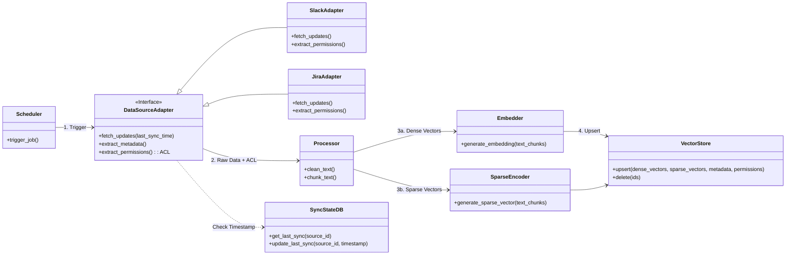
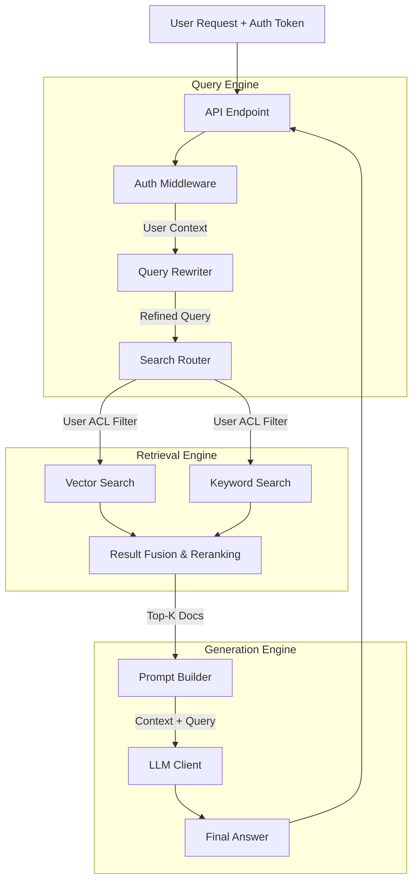

# System Design & Architecture

본 문서는 **Integrated RAG Search Service**의 상세 기술 설계를 다룹니다. 시스템은 크게 비동기로 데이터를 수집하는 **Ingestion Pipeline**과 사용자의 요청을 실시간으로 처리하는 **Serving Pipeline**으로 구성됩니다. 보안 요구사항(ACL)을 준수하기 위해 권한 관리 모듈이 각 파이프라인에 통합되어 있습니다.

---

## 1. Ingestion Pipeline (Data ETL)

Ingestion Pipeline은 다양한 외부 데이터 소스(Slack, Jira, Wiki, Notion 등)로부터 데이터를 주기적으로 수집, 가공하여 Vector DB에 적재하는 역할을 수행합니다. 확장성을 위해 **Strategy Pattern**을 적용하여 데이터 소스를 모듈화했습니다.

### 1.1. Module View


### 1.2. Core Components

#### A. Connector Layer (Extract)
- **DataSourceAdapter (Interface)**: 모든 데이터 소스 어댑터가 구현해야 할 추상 클래스입니다.
  - **`extract_permissions()`**: 각 문서별 접근 가능한 사용자 또는 그룹 목록(ACL)을 추출하여 메타데이터에 포함시켜야 합니다. (Requirement 2.3)
- **SyncStateDB**: 증분 수집(Incremental Ingestion)을 지원하기 위해 각 소스별 마지막 동기화 시점(Timestamp/Cursor)을 저장하는 경량 DB(SQLite/Redis)입니다.

#### B. Processing Layer (Transform)
- **TextCleaner**: HTML 태그 제거, 특수문자 정제, 개인정보(PII) 마스킹 등 전처리를 수행합니다.
- **Chunker**: LLM의 Context Window 한계를 고려하여 텍스트를 의미 단위로 분할합니다.
  - **Strategy**: RecursiveCharacterTextSplitter 사용 (Chunk Size: 500 tokens, Overlap: 50 tokens).

#### C. Indexing Layer (Load)
- **Embedder**: OpenAI SDK (text-embedding-3-small)를 사용하여 텍스트 청크를 Dense Vector로 변환합니다.
- **Sparse Encoder**: Hybrid Search를 위해 BM25 또는 SPLADE 모델을 사용하여 텍스트 청크를 Sparse Vector로 변환합니다. 키워드 검색 정확도를 보완합니다.
- **VectorStoreConnector**: Qdrant와 통신하며 Dense Vector와 Sparse Vector를 함께 Upsert 합니다. 이때 `permissions` 필드를 메타데이터(Payload) 필터용 인덱스로 설정해야 합니다.

## 2. Serving Pipeline (RAG Engine)
Serving Pipeline은 사용자 질문의 의도를 파악하고, **사용자 권한 내에서** 가장 적절한 지식을 검색하여 답변을 생성하는 실시간 처리 구간입니다.

### 2.1. Module View

### 2.2. Core Components

#### A. Query Engine (Input Processing)
- **Auth Middleware**: 요청 헤더의 토큰을 분석하여 사용자 ID와 소속 그룹 정보를 추출(User Context)합니다.
- **Query Rewriter (LLM Based)**:
  - **Decomposition**: 복합 질문을 하위 질문으로 분해하여 검색 정확도를 높입니다.
  - **Metadata Extraction**: 질문에서 날짜, 작성자 등을 추출합니다.
- **Search Router**: 질문의 카테고리에 따라 검색할 데이터 소스나 전략을 결정합니다.

#### B. Retrieval Engine (Search Strategy)
- **Secure Hybrid Retriever**:
  - **Security Filter**: 검색 쿼리 실행 시, `filter: { permissions: { $in: [user_id, group_id] } }` 조건을 강제로 주입하여 권한 없는 문서의 노출을 원천 차단합니다.
  - **Dense Search**: Vector Similarity (의미 검색).
  - **Sparse Search**: BM25 (키워드/고유명사 매칭).
- **Reranker (Accuracy Booster)**:
  - 1차 검색된 문서들을 Cross-Encoder 모델로 재순위화합니다.

#### C. Generation Engine (Response)
- **Prompt Builder**: 검색된 Context와 사용자 질문을 결합합니다.
- **LLM Client**: OpenAI Chat Completion API (gpt-4o)를 사용하여 답변을 생성하며, 사용된 문서의 출처(Source Link)를 반드시 포함하도록 프롬프팅합니다.

## 3. Directory Structure
프로젝트는 관심사의 분리 원칙에 따라 Ingestion과 Serving 로직을 물리적으로 분리하여 구성합니다.

```
src/
├── ingestion/                  # [Ingestion Pipeline]
│   ├── adapters/               # Source Connectors
│   │   ├── base.py             # Abstract Base Class (Fetch + ACL)
│   │   ├── slack.py
│   │   └── jira.py
│   ├── processor.py            # Cleaning & Chunking
│   ├── embedder.py             # Embedding Model Wrapper
│   └── vector_store.py         # Vector DB Connector (Upsert with Metadata)
│
├── serving/                    # [Serving Pipeline]
│   ├── core/
│   │   └── security.py         # User Context & Auth Logic
│   ├── query_engine/
│   │   ├── rewriter.py         # LLM Query Refinement & Decomposition
│   │   └── router.py           # Search Routing
│   ├── retrieval/
│   │   ├── hybrid.py           # Vector + Keyword Search (w/ Filter)
│   │   └── reranker.py         # Result Re-ranking
│   └── generation/
│   │   ├── prompt.py           # Prompt Templates
│   │   └── llm_client.py       # OpenAI Chat Completion Wrapper
│
├── common/                     # Shared Utilities
│   ├── openai_utils.py         # OpenAI Client & Error Handling
│   └── config.py               # Environment Variables
│
└── main.py                     # FastAPI Entrypoint
```

## 4. Key Design Decisions
1. **Security First**: 데이터 수집 시점부터 권한 정보를 함께 저장하고, 검색 시점에 필터를 강제함으로써 문서 레벨의 보안을 보장합니다.
2. **LLM for Query Refinement**: 사용자의 모호한 질문을 명확한 검색 쿼리로 변환하고, 필요시 하위 질문으로 분해(Decomposition)하여 복합적인 질문을 처리합니다.
3. **Hybrid Search & Reranking**: 단순 벡터 검색의 한계를 보완하기 위해 키워드 검색을 병행하고 리랭킹을 수행합니다.
